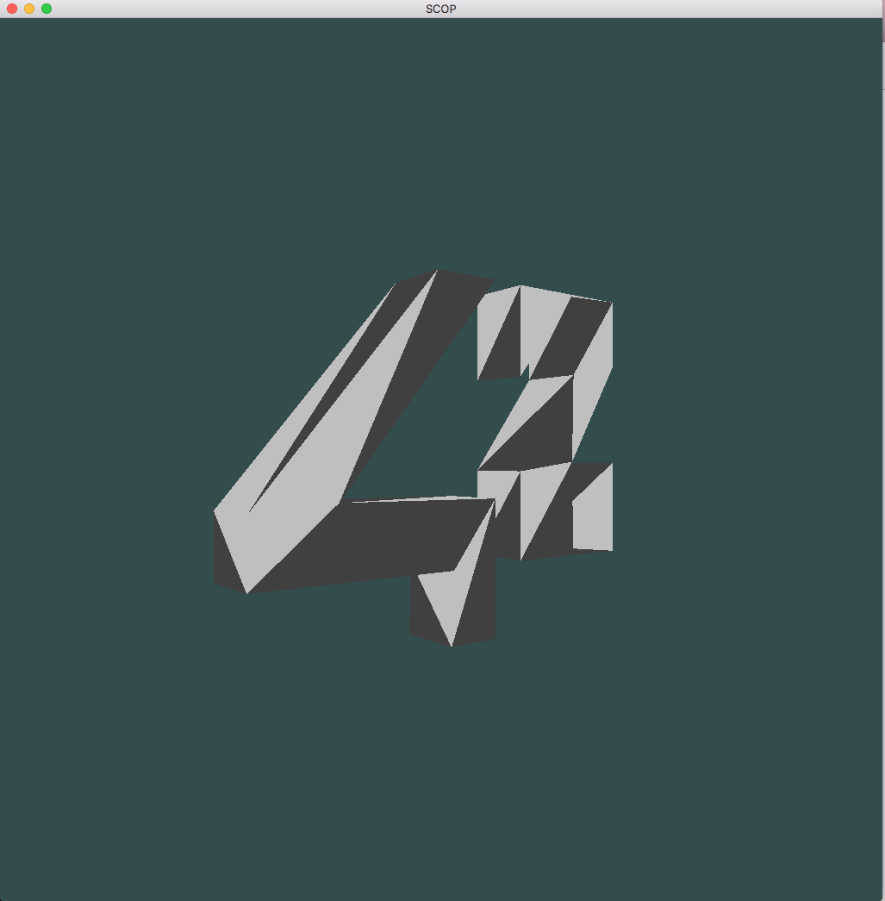
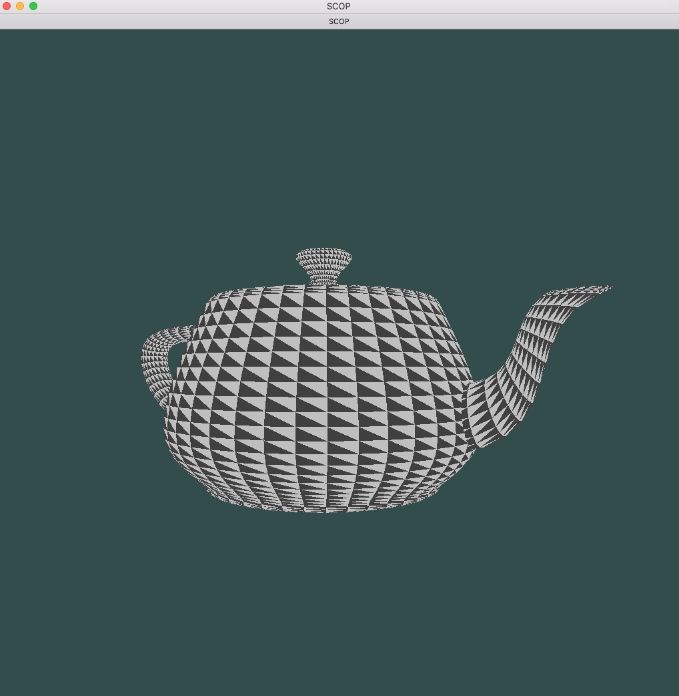
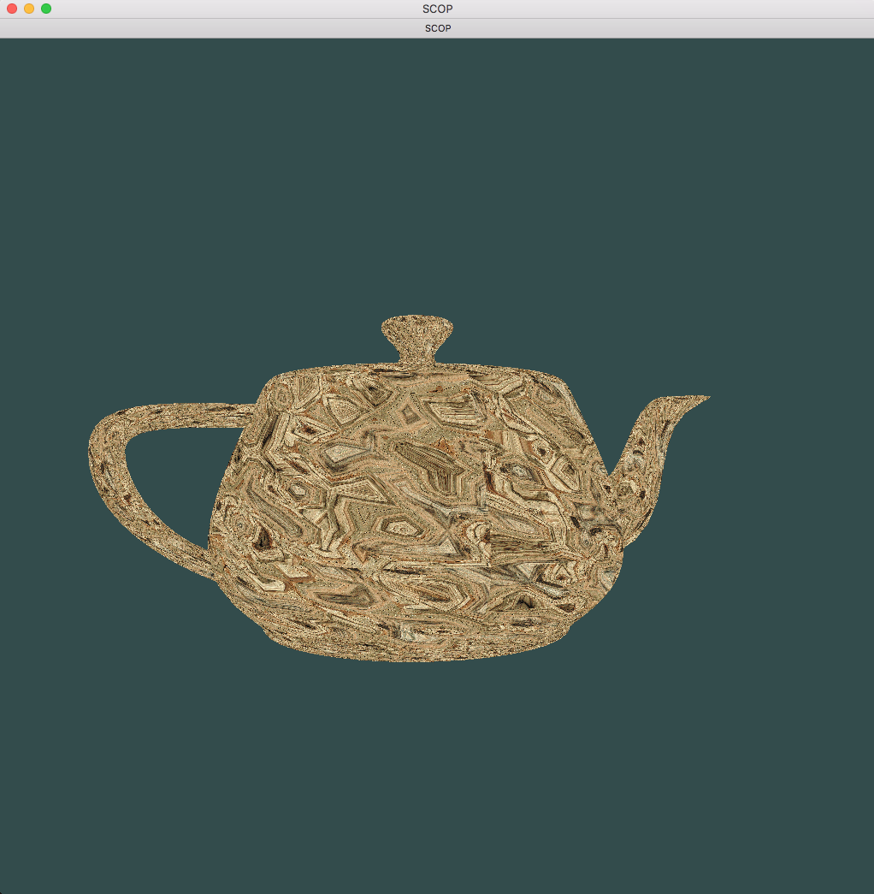

# Scop

## Description

Graphical project. The objective is to parse .OBJ files and display them using modern OpenGL with a few constraints.

### Features

Currently None!

## Dependencies

glfw
glew
openGL

* You could simply use brew to install dependencies

## Installation

Clone the repository and run with:

``` bash
$> make
$> ./bin/scop [obj]
```

## Media






## Author

Antoine Anzieu
aanzieu@student.42.fr
